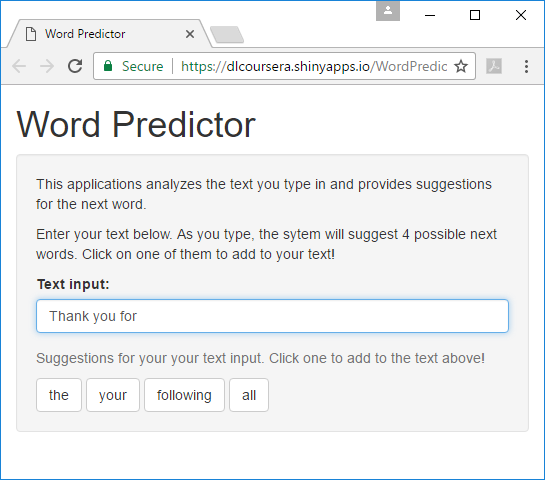

Overivew
--------

The Word Predictor improves the speed and accuracy of user text input by
suggesting the next word that the user would type. The suggestions are
based on an analysis of real user text, and are provided instantly (and
without user intervention) to avoid slowing down the host app. This app
was built as part of the Capstone project for the Data Science
specialization offered by Johns Hopkins University through Coursera.

A demo coded in R and Shiny can be found here at
<https://dlcoursera.shinyapps.io/wordpredictor/>

The UI can be seen below. As the user types in their sentence, the
system makes suggestions for the next possible word in real time. The
user can click on one of these suggestions to enter it into their text.
To maintain zero latency in the UI, trade-offs had to made between the
accuracy and size (megabytes) of the model so that it would fit into and
load quickly in a Shiny application instance.

Model and underlying data
-------------------------

### Data

Data for this sample was supplied by Coursera at:

[https://d396qusza40orc.cloudfront.net/dsscapstone/dataset/Coursera-SwiftKey.zip](%5Bhttps://d396qusza40orc.cloudfront.net/dsscapstone/dataset/Coursera-SwiftKey.zip)

The zip contains sample blog posts, news articles and tweets for
Finnish, German, Russian and US English. This sample used only the US
English documents. The documents consisted of just under 900,000 blog
articles, around 1M news articles, and around 2.35M tweets; and consumed
556 megabytes of disk space.

N-gram analysis was used using the method from the following videos:

[4 - 1 - Introduction to N-grams- Stanford NLP - Professor Dan Jurafsky
& Chris Manning](https://www.youtube.com/watch?v=s3kKlUBa3b0)

[4 - 2 - Estimating N-gram Probabilities - Stanford NLP - Professor Dan
Jurafsky & Chris Manning](https://www.youtube.com/watch?v=o-CvoOkVrnY)

The algorithm is simple but computationally expensive. Given a sequence
of words wi-n+1 ... w\\ i-1, we are looking for
the next likely word wi . This can be achieved by identifying
wi with the highest conditional probability.

count (wi-n+1 ... wi) / count (wi-n+1 .
wi-1)

If there are no suggestions for the phrase (e.g. "for the first"), the
Markov simplification or fallback is used and n is reduced by 1 and the
phrase becomes "the first".

The algorithm chosen simplifies the above method. It does not calculate
probabilities as the denominator is constant for a given phrase. To
identify the next word for a phrase of length n (e.g. "for the first"),
the first step is to identify n-grams of length (n+1).

<table>
<thead>
<tr class="header">
<th>4 gram</th>
<th>Occurrences</th>
</tr>
</thead>
<tbody>
<tr class="odd">
<td>for the first time</td>
<td>25</td>
</tr>
<tr class="even">
<td>thanks for the follow</td>
<td>23</td>
</tr>
<tr class="odd">
<td>At the same time</td>
<td>20</td>
</tr>
<tr class="even">
<td>for the first half</td>
<td>8</td>
</tr>
<tr class="odd">
<td>for the first two</td>
<td>7</td>
</tr>
<tr class="even">
<td>thanks for the great</td>
<td>6</td>
</tr>
<tr class="odd">
<td>for the first hour</td>
<td>3</td>
</tr>
</tbody>
</table>

The n-grams are then split into two parts: the first n words and the
last word. Finally, the records are then grouped by the first left part
(first n words). This has the effect of identifying the next word in
probability order of a given phrase. The suggested next words for "for
the first" are thus "time", "half", "two" and "hour".

<table>
<thead>
<tr class="header">
<th>3 gram</th>
<th>Next word</th>
<th>Occurrences</th>
</tr>
</thead>
<tbody>
<tr class="odd">
<td><strong>for the first</strong></td>
<td>time</td>
<td>25</td>
</tr>
<tr class="even">
<td><strong>for the first</strong></td>
<td>half</td>
<td>8</td>
</tr>
<tr class="odd">
<td><strong>for the first</strong></td>
<td>two</td>
<td>7</td>
</tr>
<tr class="even">
<td><strong>for the first</strong></td>
<td>hour</td>
<td>3</td>
</tr>
<tr class="odd">
<td>thanks for the</td>
<td>follow</td>
<td>23</td>
</tr>
<tr class="even">
<td>at the same</td>
<td>time</td>
<td>20</td>
</tr>
<tr class="odd">
<td>thanks for the</td>
<td>great</td>
<td>6</td>
</tr>
</tbody>
</table>

An offline model was created to support the UI. Each phrase ("for the
first") was hashed. A tuple of four next word suggestions were indexed
using that hash. (In future space could be saved by hashing single words
and storing phases as sequence of those hashes.)

When the UI requires a suggestion, it makes a prediction for up to the
last three words (e.g. "walk to the"). The UI retrieved the four
suggestions using the hash of the phrase. If there are no suggestions,
the algorithm falls back to the last two words ("to the") and then falls
back to one word. If no suggestions can be found the top 4 words by
occurrence ("the", "to", "and", "a") are returned.

Model accuracy vs size
----------------------

The model must:

-   **Maximize accuracy:** there were no target metrics (e.g. a previous
    model, or competitive benchmark) - instead best effort was made.
-   **Minimize model size:** the model needs to be loaded by the Shiny
    application instance. This is intended to be a lightweight
    application which could be suspended (i.e. made to sleep) by the
    hosting server. Thus the UI needs to quickly restart on user demand.
    From experimentation a 2MB model loaded quickly. Note: in other
    scenarios model size is not important. For example, the model is
    loaded into a high capacity server with high availability i.e. the
    model and its service is not put to sleep due to
    resource constraints.

The following variables were used to find a model:

-   **Sample size for the training data**: two values were used. 5%
    provided some coverage and could be processed quickly. 33% was the
    upper limit that could be processed with my machine (24 gig of RAM)
    using R with the Text Mining Library
    <https://cran.r-project.org/web/packages/tm/index.html>

-   **Discarding phrases** if 4 suggestions for the next word could be
    not identified. the phrase was discarded.
-   **Thresholding of phrases:** phases were discarded if the instance
    count was below a certain value. A more robust method would be to
    use the top % of data.

Accuracy was measured using a random sample of 250,000 words, 250,000
words 2-grams and 250,000 3-grams from a hold-out set of 33% of the
data. This *test* data was a different sample than the two *training*
data samples.

There were two measurements: **1st word accuracy** is defined when the
first suggestion matches the next word. For **overall accuracy** 0.75
was awarded if the second prediction matches, 0.5 if the second
prediction matches and so on.

### Chosen Model

See Appendix A for the raw data.

The chosen model used a 33% sample of data, discarded incomplete
predictions, and discarded phrases with less than 100 occurrences. The
model took 1.12 megabytes of space.

Observations:

-   Unsurprisingly increasing the sample rate increased accuracy but at
    the cost of model size.
-   Removing incomplete suggestions significantly reduced the amount of
    space needed for the model. For example, consider a model based on a
    5% sample rate with no thresholding. Discarding of incomplete
    suggestions allows the model to consume just 5.65% of the space with
    comparable accuracy.
-   Thresholding significantly reduced model size with marginal
    reductions in accuracy. In other words, the majority of the value of
    the data is in the head rather than the tail.

Running the sample
------------------

Source code can be found in the "src" directory of this repro. R code to
create the word prediction model can be found in "GenerateModel" and the
Shiny App can be found in "WordPredictor".

### Code for the Word Prediction Model

Once the sample has been downloaded, change directory to
"src/GenerateModel". To discourage plagiarism, two of the source files
("libs/generateSuggest.R" and "2A\_CreateNGram.R") have missing code. If
you would like complete versions of these files, please contact me using
an email address consisting of my first name, last name and the "org"
extension.

To get the sample working:

-   Download the sample docs from
    <https://d396qusza40orc.cloudfront.net/dsscapstone/dataset/Coursera-SwiftKey.zip>
    Once downloaded, unzip the archive and copy the US text files
    ("en\_US.blogs.txt", "en\_US.news.txt" and "en\_US.twitter.txt") to
    the "data/raw" folder. The file "en\_US.news.txt" contains 4 lines
    with bad characters: 77259, 766277, 926141 and 948564. Given the
    small number it was easier to just to remove them with a
    text editor.
-   Install the following libraries: "dplyr", "hash", "reshape",
    "RWeka", "stringr" and "tm"
-   Supply a list of profanities as "resources.txt". Ensure that the
    list contains words with the stems e.g. <WORD>ed, <WORD>ing etc.
    Once that is done open the R script "0\_Go.R". This script will
    build a model based upon a 1% sample of the data, run some test
    queries and score the model. On my machine (4 core Xeon, 24 gig RAM,
    SSD hard drive) this takes around 3 minutes. Increasing the sample
    rate will significantly improve the processing time!

If in doubt, check the appropriate pre-requisites are present, run the
"checkDependencies.R" script.

### Code for the UI

Code for the Shiny app appears in the {RepoDir}/WordPredictor directory.

To run the app:

-   Copy the "generateSuggest.R" file from {ReproDir}/GenerateModel/libs
-   Copy a model file produced from the model creation phase. The model
    must have the filename "Model"

Once done, start RStudio, and:

-   Set the working directory to {RepoDir}
-   Install the packages: "hash", "shiny", "stringr" and "tm"
-   Load the Shiny library (library ("shiny"))
-   Run the app by typing "runApp()"

If all goes well, the UI will appear and you can begin typing in a
sentence. If in doubt run the "checkDependencies.R" file in the
{RepoDir}/WordPredictor directory.

Future Work
-----------

-   Investigate the effects of document type (e.g. blogs) on
    the prediction. There is small but noticeable effect of the document
    type upon prediction (see Appendix B). For predicting the next word
    in a tweet, a model based solely upon twitter data would performance
    than a model based solely on news or blog data. Adding document type
    would significantly increase the model size. Model size is a concern
    in this scenario but not necessarily in other scenarios.
-   Implement type-ahead for words: currently suggestions are only made
    for fully entered words. To improve accuracy and thus user
    experience, the system should provide suggestions based upon
    partial words. For example, if the user types in "br" then it may
    suggest "brother", "broke", "bring" and "bright".
-   Modeling start and end of sentences. One obvious problem is the
    prediction of the first word in a sentence. Currently, the system
    suggests the top 4 words which obviously is not the best solution.
-   Punctuation should be restored . During the n-gram formation
    sentences such as "I'm" are converted to "im". On presentation to
    the user, the punctuation should be restored.

Appendix A: Model Accuracy
--------------------------

<table style="width:100%;">
<colgroup>
<col width="8%" />
<col width="12%" />
<col width="20%" />
<col width="18%" />
<col width="22%" />
<col width="16%" />
</colgroup>
<thead>
<tr class="header">
<th>Sample</th>
<th>Threshold</th>
<th>Remove incomplete</th>
<th>1st Word Av Acc</th>
<th>Overall Av Accuracy</th>
<th>Model size (K)</th>
</tr>
</thead>
<tbody>
<tr class="odd">
<td>5%</td>
<td>0</td>
<td>No</td>
<td>12.93%</td>
<td>18.13%</td>
<td>94,030</td>
</tr>
<tr class="even">
<td>5%</td>
<td>0</td>
<td>Yes</td>
<td>12.93%</td>
<td>18.88%</td>
<td>5,315</td>
</tr>
<tr class="odd">
<td>5%</td>
<td>5</td>
<td>No</td>
<td>11.13%</td>
<td>15.93%</td>
<td>82,175</td>
</tr>
<tr class="even">
<td>5%</td>
<td>5</td>
<td>Yes</td>
<td>12.99%</td>
<td>18.96%</td>
<td>4,407</td>
</tr>
<tr class="odd">
<td>5%</td>
<td>10</td>
<td>Yes</td>
<td>13.00%</td>
<td>19.13%</td>
<td>2,114</td>
</tr>
<tr class="even">
<td>5%</td>
<td>100</td>
<td>Yes</td>
<td>11.47%</td>
<td>17.63%</td>
<td>177</td>
</tr>
<tr class="odd">
<td>5%</td>
<td>1,000</td>
<td>Yes</td>
<td>8.55%</td>
<td>14.25%</td>
<td>22</td>
</tr>
<tr class="even">
<td>33%</td>
<td>5</td>
<td>No</td>
<td>13.07%</td>
<td>18.44%</td>
<td>413,769</td>
</tr>
<tr class="odd">
<td>33%</td>
<td>5</td>
<td>Yes</td>
<td>14.63%</td>
<td>21.00%</td>
<td>25,325</td>
</tr>
<tr class="even">
<td>33%</td>
<td>10</td>
<td>Yes</td>
<td>14.65%</td>
<td>21.14%</td>
<td>12,523</td>
</tr>
<tr class="odd">
<td>33%</td>
<td>100</td>
<td>Yes</td>
<td>13.42%</td>
<td>19.94%</td>
<td>1,188</td>
</tr>
<tr class="even">
<td>33%</td>
<td>1,000</td>
<td>Yes</td>
<td>11.11%</td>
<td>17.17%</td>
<td>122</td>
</tr>
</tbody>
</table>

Appendix B: Using Document Type as a Signal
-------------------------------------------

In this short experiment each of the input files (blogs, news and
twitter) was split 50-50 into separate training and test files.

Models for each source were created separately using the code in this
repo with threshold set to 5 and discarding of incomplete suggestions.
50,000 words, 50,000 2 word phrases and 50,000 3 word phases were
sampled from the twitter test data and the 3 models scored accuracy. As
can be seen from the table below, the news model only achieved less than
75% of the accuracy of the twitter model. This is very early result but
it does indicate there is some effect of document type.

<table>
<colgroup>
<col width="9%" />
<col width="29%" />
<col width="28%" />
<col width="32%" />
</colgroup>
<thead>
<tr class="header">
<th>Model</th>
<th>Average 1st word accuracy</th>
<th>Average Overall accuracy</th>
<th>Average Overall accuracy lift</th>
</tr>
</thead>
<tbody>
<tr class="odd">
<td>Twitter</td>
<td>14.50%</td>
<td>21.55%</td>
<td>100.00%</td>
</tr>
<tr class="even">
<td>News</td>
<td>10.78%</td>
<td>16.05%</td>
<td>74.45%</td>
</tr>
<tr class="odd">
<td>Blogs</td>
<td>12.15%</td>
<td>18.21%</td>
<td>84.49%</td>
</tr>
</tbody>
</table>
